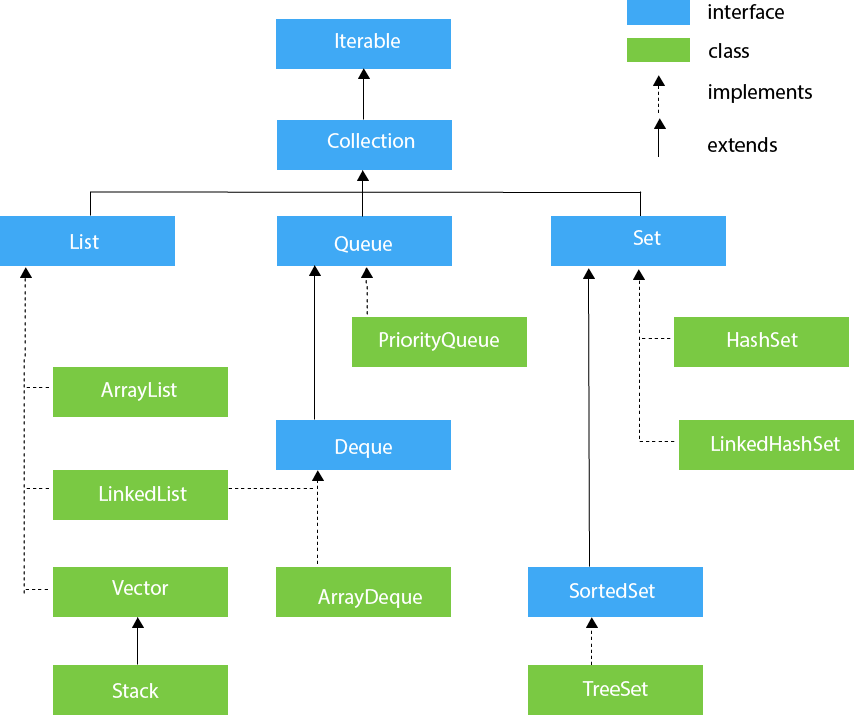

# **Java and Spring Learning Materials**

- [**Java and Spring Learning Materials**](#java-and-spring-learning-materials)
  * [**Chapter 1 : Fundamentals of Java**](#chapter-1--fundamentals-of-java)
  * [**Chapter 2: Intermediate Java**](#chapter-2-intermediate-java)
  * [**Chapter 3: Advanced Java**](#chapter-3-advanced-java)
  * [**Chapter 4: Java Build Tools**](#chapter-4-java-build-tools)
  * [**Chapter 5: Java EE**](#chapter-5-java-ee)
  * [**Chapter 6: Clean Code and Design Patterns**](#chapter--6-clean-code-and-design-patterns)
  * [**Chapter 7: Java Spring Framework and Spring Boot**](#chapter-7-java-spring-framework-and-spring-boot)

## **Chapter 1 : Fundamentals of Java**

**1.1 Primitives**

1.1.1 [https://www.baeldung.com/java-primitives](https://www.baeldung.com/java-primitives) 

1.1.2 [https://docs.oracle.com/javase/tutorial/java/nutsandbolts/datatypes.html](https://docs.oracle.com/javase/tutorial/java/nutsandbolts/datatypes.html) 

**1.2 Conditionals**

**1.2.1. Basics**

[https://www.baeldung.com/java-control-structures](https://www.baeldung.com/java-control-structures) 

**1.2.2 Some conventions to follow**

[https://www.baeldung.com/java-using-not-in-if-conditions](https://www.baeldung.com/java-using-not-in-if-conditions) 

**1.2.3 Switch Case **

[https://www.baeldung.com/java-switch](https://www.baeldung.com/java-switch) 

**1.3 Loops**

* [https://www.baeldung.com/java-loops](https://www.baeldung.com/java-loops) 

**1.4 OOP**

**1.4.1. Class, Interfaces, Abstract Class, Access Modifiers**

* [https://www.baeldung.com/java-oop](https://www.baeldung.com/java-oop) 
* [https://www.baeldung.com/java-concrete-class](https://www.baeldung.com/java-concrete-class) 
* [https://www.codejava.net/java-core/the-java-language/9-rules-about-constructors-in-java](https://www.codejava.net/java-core/the-java-language/9-rules-about-constructors-in-java) 
* [https://www.codejava.net/java-core/the-java-language/everything-you-need-to-know-about-interfaces-in-java](https://www.codejava.net/java-core/the-java-language/everything-you-need-to-know-about-interfaces-in-java) 
* [https://java2blog.com/difference-between-abstract-class-and-interface-in-java](https://java2blog.com/difference-between-abstract-class-and-interface-in-java) 
* [https://www.baeldung.com/java-access-modifiers](https://www.baeldung.com/java-access-modifiers) 
* [https://www.codejava.net/java-core/the-java-language/java-access-modifiers-examples-public-protected-private-and-default](https://www.codejava.net/java-core/the-java-language/java-access-modifiers-examples-public-protected-private-and-default) 

**1.4.2 Encapsulation**

* [https://www.codejava.net/java-core/the-java-language/what-is-encapsulation-in-java-the-what-why-and-how](https://www.codejava.net/java-core/the-java-language/what-is-encapsulation-in-java-the-what-why-and-how) 

**1.4.3 Abstraction**

* [https://www.codejava.net/java-core/the-java-language/what-is-abstraction-in-java-the-why-and-the-truth](https://www.codejava.net/java-core/the-java-language/what-is-abstraction-in-java-the-why-and-the-truth)

* [https://www.javatpoint.com/abstract-class-in-java#:~:text=in%20Java%20first.-,Abstraction%20in%20Java,text%20and%20send%20the%20message.](https://www.javatpoint.com/abstract-class-in-java#:~:text=in%20Java%20first.-,Abstraction%20in%20Java,text%20and%20send%20the%20message.) 

**1.4.4 Inheritance**

* [https://www.codejava.net/java-core/the-java-language/what-is-inheritance-in-java-the-what-why-and-how](https://www.codejava.net/java-core/the-java-language/what-is-inheritance-in-java-the-what-why-and-how) 
* [https://www.codejava.net/java-core/the-java-language/12-rules-and-examples-about-inheritance-in-java](https://www.codejava.net/java-core/the-java-language/12-rules-and-examples-about-inheritance-in-java) 
* [https://www.baeldung.com/java-inheritance-composition](https://www.baeldung.com/java-inheritance-composition) 

**1.4.5 Polymorphism**

* [https://www.codejava.net/java-core/the-java-language/what-is-polymorphism-in-java-the-what-how-and-why](https://www.codejava.net/java-core/the-java-language/what-is-polymorphism-in-java-the-what-how-and-why) 

**1.4.6 Overloading & Overriding**

* [https://www.codejava.net/java-core/the-java-language/what-is-overloading-in-java-and-examples](https://www.codejava.net/java-core/the-java-language/what-is-overloading-in-java-and-examples) 
* [https://www.codejava.net/java-core/the-java-language/12-rules-of-overriding-in-java-you-should-know](https://www.codejava.net/java-core/the-java-language/12-rules-of-overriding-in-java-you-should-know) 
* [https://www.codejava.net/java-core/the-java-language/differences-between-overriding-and-overloading](https://www.codejava.net/java-core/the-java-language/differences-between-overriding-and-overloading)
* [https://www.javatpoint.com/covariant-return-type](https://www.javatpoint.com/covariant-return-type)
* [Hidden Method](https://www.javatpoint.com/method-hiding-in-java#:~:text=What%20is%20method%20hiding%3F&text=Method%20hiding%20can%20be%20defined,is%20known%20as%20method%20hiding.)

**1.4.7 Miscellaneous**

* [https://www.baeldung.com/java-this](https://www.baeldung.com/java-this) 
* [https://www.baeldung.com/java-type-casting](https://www.baeldung.com/java-type-casting) 
* [https://www.baeldung.com/java-static](https://www.baeldung.com/java-static) 
* [https://java2blog.com/final-keyword-java-example/](https://java2blog.com/final-keyword-java-example/) 
* [https://java2blog.com/static-block-java/](https://java2blog.com/static-block-java/) 
* [https://java2blog.com/java-static-import-example/](https://java2blog.com/java-static-import-example/)
* [Java Variables Passing Examples - Pass-by-value or Pass-by-reference?](https://codejava.net/java-core/the-java-language/java-variables-passing-examples-pass-by-value-or-pass-by-reference)
* [https://www.baeldung.com/java-wrapper-classes](https://www.baeldung.com/java-wrapper-classes)  
* [https://www.javatpoint.com/java-bean](https://www.javatpoint.com/java-bean)
* [https://stackoverflow.com/a/3295517/10197771](https://stackoverflow.com/a/3295517/10197771) 
* [https://www.baeldung.com/java-pojo-class](https://www.baeldung.com/java-pojo-class) 
* [https://www.baeldung.com/a-guide-to-java-enums](https://www.baeldung.com/a-guide-to-java-enums) 
* [https://www.baeldung.com/java-tostring](https://www.baeldung.com/java-tostring) 
* [https://www.baeldung.com/java-equals-hashcode-contracts](https://www.baeldung.com/java-equals-hashcode-contracts) 
* [https://www.baeldung.com/java-bigdecimal-biginteger](https://www.baeldung.com/java-bigdecimal-biginteger) 
* [https://www.baeldung.com/java-serialization](https://www.baeldung.com/java-serialization) 
* [https://dzone.com/articles/what-is-serialization-everything-about-java-serial](https://dzone.com/articles/what-is-serialization-everything-about-java-serial) 
* [https://stackoverflow.com/a/37632/10197771](https://stackoverflow.com/a/37632/10197771) 

**1.5 String**

* [https://www.techiedelight.com/difference-between-string-stringbuilder-java/#:~:text=A%20String%20is%20immutable%20in,created%20in%20the%20string%20pool](https://www.techiedelight.com/difference-between-string-stringbuilder-java/#:~:text=A%20String%20is%20immutable%20in,created%20in%20the%20string%20pool). 
* Check String API Section from here: [https://www.baeldung.com/java-string](https://www.baeldung.com/java-string) 
* [https://java2blog.com/core-java-tutorial-for-beginners-experienced/#Chapter_11_String_Handling](https://java2blog.com/core-java-tutorial-for-beginners-experienced/#Chapter_11_String_Handling) 

**1.6 Exception Handling**

* [https://www.baeldung.com/java-exceptions](https://www.baeldung.com/java-exceptions) 
* [https://www.baeldung.com/java-checked-unchecked-exceptions](https://www.baeldung.com/java-checked-unchecked-exceptions) 
* [https://java2blog.com/difference-between-throw-and-throws-in-java/](https://java2blog.com/difference-between-throw-and-throws-in-java/) 
* [https://www.baeldung.com/java-new-custom-exception](https://www.baeldung.com/java-new-custom-exception) 

## **Chapter 2: Intermediate Java**

**2.1 Collections**

* What is Collections Framework: [https://www.codejava.net/java-core/collections/what-is-java-collections-framework](https://www.codejava.net/java-core/collections/what-is-java-collections-framework) 

_Fig: Collections Framework Hierarchy, Source: [https://www.javatpoint.com/collections-in-java](https://www.javatpoint.com/collections-in-java)_

* List:
    * [https://www.codejava.net/java-core/collections/java-list-collection-tutorial-and-examples](https://www.codejava.net/java-core/collections/java-list-collection-tutorial-and-examples) 
    * [https://www.codejava.net/java-core/collections/sorting-list-collections-examples](https://www.codejava.net/java-core/collections/sorting-list-collections-examples) 
    * [https://www.codejava.net/java-core/collections/sorting-a-list-by-multiple-attributes-example](https://www.codejava.net/java-core/collections/sorting-a-list-by-multiple-attributes-example) 
    * [Converting Iterator to List ](https://www.baeldung.com/java-convert-iterator-to-list)
    * [Java – Get Random Item/Element From a List ](https://www.baeldung.com/java-random-list-element)
    * [Partition a List in Java ](https://www.baeldung.com/java-list-split)
    * [Removing all nulls from a List in Java ](https://www.baeldung.com/java-remove-nulls-from-list)
    * [Removing all duplicates from a List in Java ](https://www.baeldung.com/java-remove-duplicates-from-list)
    * [Removing all Nulls from a List in Java ](https://www.baeldung.com/java-remove-nulls-from-list)
    * [Check If Two Lists are Equal in Java ](https://www.baeldung.com/java-test-a-list-for-ordinality-and-equality)
    * [How to Find an Element in a List with Java ](https://www.baeldung.com/find-list-element-java)(popular)
    * [Java List UnsupportedOperationException ](https://www.baeldung.com/java-list-unsupported-operation-exception)
    * [Copy a List to Another List in Java ](https://www.baeldung.com/java-copy-list-to-another)
    * [Remove All Occurrences of a Specific Value from a List ](https://www.baeldung.com/java-remove-value-from-list)
    * [Add Multiple Items to an Java ArrayList ](https://www.baeldung.com/java-add-items-array-list)
    * [Remove the First Element from a List ](https://www.baeldung.com/java-remove-first-element-from-list)
    * [Ways to Iterate Over a List in Java ](https://www.baeldung.com/java-iterate-list)
    * [Intersection of Two Lists in Java ](https://www.baeldung.com/java-lists-intersection)
    * [How to Count Duplicate Elements in Arraylist ](https://www.baeldung.com/java-count-duplicate-elements-arraylist)
    * [Finding the Differences Between Two Lists in Java ](https://www.baeldung.com/java-lists-difference)
    * [Reversing a Linked List in Java ](https://www.baeldung.com/java-reverse-linked-list)
    * [Assert Two Lists for Equality Ignoring Order in Java](https://www.baeldung.com/java-assert-lists-equality-ignore-order%20)
* Set:
    * [https://www.codejava.net/java-core/collections/java-set-collection-tutorial-and-examples](https://www.codejava.net/java-core/collections/java-set-collection-tutorial-and-examples) 
    * [https://www.baeldung.com/java-tree-set](https://www.baeldung.com/java-tree-set) 
    * [https://www.baeldung.com/java-hashset](https://www.baeldung.com/java-hashset) 
* Map:
    * [https://www.baeldung.com/java-hashmap](https://www.baeldung.com/java-hashmap) 
    * [https://www.baeldung.com/java-hashmap-advanced](https://www.baeldung.com/java-hashmap-advanced) 
    * [https://www.baeldung.com/java-treemap](https://www.baeldung.com/java-treemap) 
    * [https://www.baeldung.com/java-treemap-vs-hashmap](https://www.baeldung.com/java-treemap-vs-hashmap) 
    * [How to Store Duplicate Keys in a Map in Java? ](https://www.baeldung.com/java-map-duplicate-keys)
    * [Initialize a HashMap in Java ](https://www.baeldung.com/java-initialize-hashmap)**
    * [Merging Two Maps with Java 8 ](https://www.baeldung.com/java-merge-maps)
    * [Sort a HashMap in Java ](https://www.baeldung.com/java-hashmap-sort)
    * [Comparing Two HashMaps in Java ](https://www.baeldung.com/java-compare-hashmaps)
    * [Using the Map.Entry Java Class ](https://www.baeldung.com/java-map-entry)
    * [Working With Maps Using Streams](https://www.baeldung.com/java-maps-streams) **
    * [Using the Map.Entry Java Class](https://www.baeldung.com/java-map-entry)
    * [Iterate over a Map in Java](https://www.baeldung.com/java-iterate-map) **
* Miscellaneous:
    * [Converting between an Array and a List in Java ](https://www.baeldung.com/convert-array-to-list-and-list-to-array)
    * [Converting Between an Array and a Set in Java ](https://www.baeldung.com/convert-array-to-set-and-set-to-array)
    * [Converting between a List and a Set in Java ](https://www.baeldung.com/convert-list-to-set-and-set-to-list)
    * [Convert a Map to an Array, List or Set in Java ](https://www.baeldung.com/convert-map-values-to-array-list-set)
    * [How to Convert List to Map in Java ](https://www.baeldung.com/java-list-to-map)(popular)
    * [Map to String Conversion in Java ](https://www.baeldung.com/java-map-to-string-conversion)
    * [Arrays.asList vs new ArrayList(Arrays.asList()) ](https://www.baeldung.com/java-arrays-aslist-vs-new-arraylist)
    * [Collecting Stream Elements into a List in Java](https://www.baeldung.com/java-stream-to-list-collecting)
    * [The Difference Between Collection.stream().forEach() and Collection.forEach()](https://www.baeldung.com/java-collection-stream-foreach)
    * [A Guide to Iterator in Java](https://www.baeldung.com/java-iterator)
    * [https://www.baeldung.com/java-collections-complexity](https://www.baeldung.com/java-collections-complexity) 

**2.2  Generics**

* [https://www.baeldung.com/java-generics](https://www.baeldung.com/java-generics) 
* [http://tutorials.jenkov.com/java-generics/wildcards.html](http://tutorials.jenkov.com/java-generics/wildcards.html) (Optional)

**2.3 Streams and Lambdas**

* [https://www.oracle.com/webfolder/technetwork/tutorials/obe/java/Lambda-QuickStart/index.html](https://www.oracle.com/webfolder/technetwork/tutorials/obe/java/Lambda-QuickStart/index.html) 
* [https://www.jrebel.com/blog/java-streams-in-java-8#:~:text=Java%20streams%20enable%20functional%2Dstyle,where%20you%20can%20store%20elements](https://www.jrebel.com/blog/java-streams-in-java-8#:~:text=Java%20streams%20enable%20functional%2Dstyle,where%20you%20can%20store%20elements). 
* [https://reflectoring.io/comprehensive-guide-to-java-streams/](https://reflectoring.io/comprehensive-guide-to-java-streams/) 
* [https://www.capitalone.com/tech/software-engineering/java-streams-explained-simple-example/](https://www.capitalone.com/tech/software-engineering/java-streams-explained-simple-example/) 
* Video Tutorials from java brains - [https://www.youtube.com/watch?v=gpIUfj3KaOc&list=PLqq-6Pq4lTTa9YGfyhyW2CqdtW9RtY-I3&ab_channel=JavaBrains](https://www.youtube.com/watch?v=gpIUfj3KaOc&list=PLqq-6Pq4lTTa9YGfyhyW2CqdtW9RtY-I3&ab_channel=JavaBrains) 
* [https://github.com/winterbe/java8-tutorial](https://github.com/winterbe/java8-tutorial) 

**2.4 Optional**

* [https://github.com/winterbe/java8-tutorial#optionals](https://github.com/winterbe/java8-tutorial#optionals)
* [https://www.baeldung.com/java-optional](https://www.baeldung.com/java-optional) 

**2.5 Annotations**

* [https://jenkov.com/tutorials/java-reflection/index.html](https://jenkov.com/tutorials/java-reflection/index.html) 
* [https://www.baeldung.com/java-reflection](https://www.baeldung.com/java-reflection)
* [https://docs.oracle.com/javase/tutorial/java/annotations/index.html](https://docs.oracle.com/javase/tutorial/java/annotations/index.html)
* [https://www.baeldung.com/java-default-annotations](https://www.baeldung.com/java-default-annotations)
* [Custom Annotation: https://www.youtube.com/watch?v=DkZr7_c9ry8](https://www.youtube.com/watch?v=DkZr7_c9ry8)
* [https://reflectoring.io/java-annotation-processing/](https://reflectoring.io/java-annotation-processing/)
* [https://github.com/winterbe/java8-tutorial#annotations](https://github.com/winterbe/java8-tutorial#annotations) 
* [https://www.baeldung.com/java-default-annotations](https://www.baeldung.com/java-default-annotations) 
* [@Deprecated annotation examples](https://codejava.net/java-core/the-java-language/deprecated-annotation-examples)
* [@Override annotation examples](https://codejava.net/java-core/the-java-language/override-annotation-examples)
* [@SuppressWarnings annotation examples](https://codejava.net/java-core/the-java-language/suppresswarnings-annotation-examples)
* [Annotations under the hood](https://hannesdorfmann.com/annotation-processing/annotationprocessing101/)

**2.6 Date API**

* [https://github.com/winterbe/java8-tutorial#date-api](https://github.com/winterbe/java8-tutorial#date-api) 

**2.7 Command Line Tools for Java**

* [https://codejava.net/java-core/tools](https://codejava.net/java-core/tools) 

## **Chapter 3: Advanced Java**

**3.1 Concurrency**

* All 14 Parts - [https://foojay.io/today/java-thread-programming-part-1/](https://foojay.io/today/java-thread-programming-part-1/)  
* Synchronized - [https://www.baeldung.com/java-synchronized](https://www.baeldung.com/java-synchronized)
* Volatile - [https://jenkov.com/tutorials/java-concurrency/volatile.html](https://jenkov.com/tutorials/java-concurrency/volatile.html)
* Completable Future - [https://www.baeldung.com/java-completablefuture](https://www.baeldung.com/java-completablefuture)
* Oracle Docs - [https://docs.oracle.com/javase/tutorial/essential/concurrency/index.html](https://docs.oracle.com/javase/tutorial/essential/concurrency/index.html)
* Synchronization and Locks - [https://web.mit.edu/6.005/www/fa15/classes/23-locks/](https://web.mit.edu/6.005/www/fa15/classes/23-locks/)
* Reentrant Lock - [https://www.geeksforgeeks.org/reentrantreadwritelock-class-in-java/](https://www.geeksforgeeks.org/reentrantreadwritelock-class-in-java/)
* Executor Service - [https://jenkov.com/tutorials/java-util-concurrent/executorservice.html](https://jenkov.com/tutorials/java-util-concurrent/executorservice.html)
* Thread Pool - [https://www.geeksforgeeks.org/thread-pools-java/](https://www.geeksforgeeks.org/thread-pools-java/)
* Thread Pool Executor - [https://www.digitalocean.com/community/tutorials/threadpoolexecutor-java-thread-pool-example-executorservice](https://www.digitalocean.com/community/tutorials/threadpoolexecutor-java-thread-pool-example-executorservice)
* Fork Join Framework - [https://www.educative.io/answers/what-is-the-use-of-fork-join-framework-in-java](https://www.educative.io/answers/what-is-the-use-of-fork-join-framework-in-java)

**3.2 Features of Java 8 and later**

* Java 8 Features: [https://www.javacodegeeks.com/java-8-features-tutorial.html](https://www.javacodegeeks.com/java-8-features-tutorial.html)
* Java 9 Features: [https://www.baeldung.com/new-java-9](https://www.baeldung.com/new-java-9)
* Java 10 Features: [https://www.baeldung.com/java-10-overview](https://www.baeldung.com/java-10-overview)
* Java 11 Features: [https://www.baeldung.com/java-11-new-features](https://www.baeldung.com/java-11-new-features)
* Java 12 Features: [https://www.baeldung.com/java-12-new-features](https://www.baeldung.com/java-12-new-features)
* Java 13 Features: [https://www.baeldung.com/java-13-new-features](https://www.baeldung.com/java-13-new-features)
* Java 14 Features: [https://www.baeldung.com/java-14-new-features](https://www.baeldung.com/java-14-new-features)
* Java 15 Features: [https://www.baeldung.com/java-15-new](https://www.baeldung.com/java-15-new)
* Java 16 Features: [https://blogs.oracle.com/java-platform-group/the-arrival-of-java-16](https://blogs.oracle.com/java-platform-group/the-arrival-of-java-16)
* Java 17 Features: [https://www.techgeeknext.com/java/java17-features](https://www.techgeeknext.com/java/java17-features) 
* Java 18 Features: [https://www.happycoders.eu/java/java-18-features/](https://www.happycoders.eu/java/java-18-features/) 

**Miscellaneous**

* [Understanding Object Ordering in Java with Comparable and Comparator](https://codejava.net/java-core/collections/understanding-object-ordering-in-java-with-comparable-and-comparator)
* [Understanding Collections and Thread Safety in Java](https://codejava.net/java-core/collections/understanding-collections-and-thread-safety-in-java)
* [18 Java Collections and Generics Best Practices](https://codejava.net/java-core/collections/18-java-collections-and-generics-best-practices)
* [Generics with extends and super Wildcards and the Get and Put Principle](https://codejava.net/java-core/collections/generics-with-extends-and-super-wildcards-and-the-get-and-put-principle)
* [Generics with Subtyping and the Substitution Principle](https://codejava.net/java-core/collections/generics-with-subtyping-and-the-substitution-principle)
* [Differences between static and non-static stuffs in Java](https://codejava.net/java-core/the-java-language/differences-between-static-and-non-static-stuffs-in-java)
* [What is Upcasting and Downcasting in Java](https://codejava.net/java-core/the-java-language/what-is-upcasting-and-downcasting-in-java)
* [https://jenkov.com/tutorials/java-reflection/index.html](https://jenkov.com/tutorials/java-reflection/index.html) 
* [https://www.baeldung.com/java-reflection](https://www.baeldung.com/java-reflection) 

## **Chapter 4: Java Build Tools**

* Maven - Video Tutorial (Java Brains) : [https://www.youtube.com/watch?v=al7bRZzz4oU&list=PL92E89440B7BFD0F6&index=1&ab_channel=JavaBrainsJavaBrainsVerified](https://www.youtube.com/watch?v=al7bRZzz4oU&list=PL92E89440B7BFD0F6&index=1&ab_channel=JavaBrainsJavaBrainsVerified)
* Gradle - Video Tutorial (Linkedin Learning) : [https://www.linkedin.com/learning/gradle-for-java-developers](https://www.linkedin.com/learning/gradle-for-java-developers)

## **Chapter 5: Java EE**

**5.1 Servlet**

* What is Apache tomcat? : [https://www.youtube.com/watch?v=kkQOm02kep0&ab_channel=KKJavaTutorialsKKJavaTutorials](https://www.youtube.com/watch?v=kkQOm02kep0&ab_channel=KKJavaTutorialsKKJavaTutorials)
* What is Servlet? : [https://www.javatpoint.com/servlet-tutorial](https://www.javatpoint.com/servlet-tutorial)
* Lifecycle of a Servlet : [https://www.javatpoint.com/life-cycle-of-a-servlet](https://www.javatpoint.com/life-cycle-of-a-servlet)
* How Servlet Works? : [https://www.javatpoint.com/how-servlet-works](https://www.javatpoint.com/how-servlet-works)
* Servlet Context : [https://www.javatpoint.com/servletcontext](https://www.javatpoint.com/servletcontext)
* Servlet Filter : [https://www.javatpoint.com/servlet-filter](https://www.javatpoint.com/servlet-filter)
* What is war file? : [https://www.javatpoint.com/war-file](https://www.javatpoint.com/war-file)
* Introduction to Servlet : Video Tutorial - [https://www.youtube.com/watch?v=7TOmdDJc14s](https://www.youtube.com/watch?v=7TOmdDJc14s)
* Intro to servlets - [https://www.baeldung.com/intro-to-servlets](https://www.baeldung.com/intro-to-servlets)
* Oracle Servlet Documentation : [https://docs.oracle.com/javaee/6/tutorial/doc/bnafd.html](https://docs.oracle.com/javaee/6/tutorial/doc/bnafd.html)
* Servlet MVC : [https://www.baeldung.com/mvc-servlet-jsp](https://www.baeldung.com/mvc-servlet-jsp)

## **Chapter  6: Clean Code and Design Patterns**

**5.1 SOLID Principles**

* https://medium.com/backticks-tildes/the-s-o-l-i-d-principles-in-pictures-b34ce2f1e898

## **Chapter 7: Java Spring Framework and Spring Boot**

**7.1 Overview of Spring Framework**

* [https://docs.spring.io/spring-framework/docs/5.0.0.RC2/spring-framework-reference/overview.html#:~:text=The%20Spring%20Framework%20consists%20of,shown%20in%20the%20following%20diagram](https://docs.spring.io/spring-framework/docs/5.0.0.RC2/spring-framework-reference/overview.html#:~:text=The%20Spring%20Framework%20consists%20of,shown%20in%20the%20following%20diagram). 
* [https://www.baeldung.com/spring-why-to-choose](https://www.baeldung.com/spring-why-to-choose) 

**7.2 Beans, Inversion of Control, Dependency Injection**

* [https://codejava.net/frameworks/spring/understanding-the-core-of-spring-framework](https://codejava.net/frameworks/spring/understanding-the-core-of-spring-framework) 
* [https://www.baeldung.com/spring-bean](https://www.baeldung.com/spring-bean) 
* [https://www.baeldung.com/inversion-control-and-dependency-injection-in-spring](https://www.baeldung.com/inversion-control-and-dependency-injection-in-spring) 
* [https://www.baeldung.com/spring-autowire](https://www.baeldung.com/spring-autowire) 
* [https://www.baeldung.com/spring-bean-annotations](https://www.baeldung.com/spring-bean-annotations) 
* [https://stackoverflow.com/a/34174782/10197771](https://stackoverflow.com/a/34174782/10197771) 
* [https://www.baeldung.com/spring-annotations-resource-inject-autowire](https://www.baeldung.com/spring-annotations-resource-inject-autowire) 
* [https://stackoverflow.com/a/9106576/10197771](https://stackoverflow.com/a/9106576/10197771)
* [https://www.baeldung.com/circular-dependencies-in-spring](https://www.baeldung.com/circular-dependencies-in-spring)
* [https://www.baeldung.com/spring-unsatisfied-dependency](https://www.baeldung.com/spring-unsatisfied-dependency)
* [https://www.baeldung.com/spring-bean-scopes](https://www.baeldung.com/spring-bean-scopes) 

**7.3 Spring MVC, Spring Boot**

* Spring MVC : [https://www.baeldung.com/spring-mvc-tutorial](https://www.baeldung.com/spring-mvc-tutorial)
* Dispatcher Servlet : [https://www.baeldung.com/spring-dispatcherservlet](https://www.baeldung.com/spring-dispatcherservlet) 
* [https://stackoverflow.com/a/2769523/10197771](https://stackoverflow.com/a/2769523/10197771) 
* Spring vs Spring Boot : [https://www.baeldung.com/spring-vs-spring-boot](https://www.baeldung.com/spring-vs-spring-boot)
* Spring Boot : [https://spring.io/guides/gs/spring-boot/](https://spring.io/guides/gs/spring-boot/)
* [https://codejava.net/frameworks/spring-boot/spring-vs-spring-boot](https://codejava.net/frameworks/spring-boot/spring-vs-spring-boot) 
* [https://medium.com/edureka/what-is-dependency-injection-5006b53af782](https://medium.com/edureka/what-is-dependency-injection-5006b53af782) 
* [https://www.baeldung.com/spring-requestmapping](https://www.baeldung.com/spring-requestmapping) 
* [https://www.baeldung.com/spring-request-param](https://www.baeldung.com/spring-request-param) 
* [https://www.baeldung.com/spring-controller-vs-restcontroller](https://www.baeldung.com/spring-controller-vs-restcontroller) 
* [https://www.baeldung.com/spring-mvc-view-resolver-tutorial](https://www.baeldung.com/spring-mvc-view-resolver-tutorial) 
* [https://spring.io/guides/gs/serving-web-content/](https://spring.io/guides/gs/serving-web-content/) 
* [https://www.baeldung.com/building-a-restful-web-service-with-spring-and-java-based-configuration](https://www.baeldung.com/building-a-restful-web-service-with-spring-and-java-based-configuration)
* Extra - Video Course from Java Brains : [https://www.youtube.com/watch?v=YXlSkWq04jk&list=PLqq-6Pq4lTTbx8p2oCgcAQGQyqN8XeA1x&index=4&ab_channel=JavaBrainsJavaBrainsVerified](https://www.youtube.com/watch?v=YXlSkWq04jk&list=PLqq-6Pq4lTTbx8p2oCgcAQGQyqN8XeA1x&index=4&ab_channel=JavaBrainsJavaBrainsVerified) 

**7.4 Properties, Profiles, Value Annotations**

* [https://www.javadevjournal.com/spring/spring-profiles/](https://www.javadevjournal.com/spring/spring-profiles/) 
* [https://www.baeldung.com/spring-profiles](https://www.baeldung.com/spring-profiles) 
* [https://www.baeldung.com/spring-value-annotation](https://www.baeldung.com/spring-value-annotation) 

**7.5 Spring JDBC, Persistence, JPA**

* [https://www.baeldung.com/spring-jdbc-jdbctemplate](https://www.baeldung.com/spring-jdbc-jdbctemplate) 
* [https://www.javatpoint.com/jpa-tutorial](https://www.javatpoint.com/jpa-tutorial) 
* [https://www.baeldung.com/the-persistence-layer-with-spring-and-jpa](https://www.baeldung.com/the-persistence-layer-with-spring-and-jpa) 
* [https://www.baeldung.com/the-persistence-layer-with-spring-data-jpa](https://www.baeldung.com/the-persistence-layer-with-spring-data-jpa) 

**7.6 Spring Security**

* [https://www.youtube.com/watch?v=sm-8qfMWEV8&list=PLqq-6Pq4lTTYTEooakHchTGglSvkZAjnE&ab_channel=LinuxTexLinuxTex](https://www.youtube.com/watch?v=sm-8qfMWEV8&list=PLqq-6Pq4lTTYTEooakHchTGglSvkZAjnE&ab_channel=LinuxTexLinuxTex) 

**7.7 Miscellaneous**

* [https://www.baeldung.com/spring-template-engines](https://www.baeldung.com/spring-template-engines) 
* [https://www.baeldung.com/jackson-object-mapper-tutorial](https://www.baeldung.com/jackson-object-mapper-tutorial)
