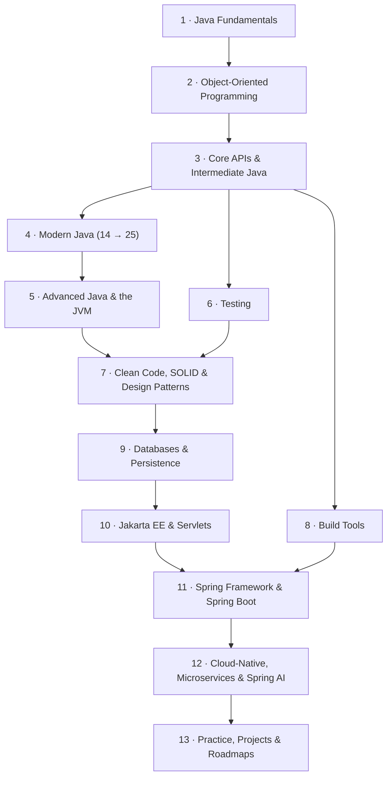
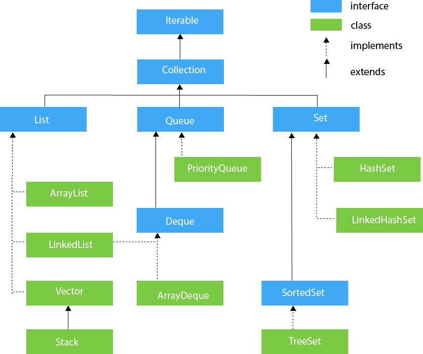

# ☕ Java & Spring — The Modern Learning Roadmap

> A curated, opinionated path from **zero to production-grade** Java and Spring Boot — refreshed for **Java 25 (LTS)** and **Spring Boot 4 / Spring Framework 7**.

  
  
  
  
  
  

Whether you're writing your first `main` method or hardening a microservice for production, this repo maps **what to learn, in what order, with the best free resource for each step**. Every link is hand-picked; the roadmap is kept current with the modern Java platform (records, sealed types, pattern matching, virtual threads) and the Spring Boot 3/4 generation.

---

## 🗺️ The Roadmap at a Glance

```mermaid
flowchart TD
    A["1 · Java Fundamentals"] --> B["2 · Object-Oriented Programming"]
    B --> C["3 · Core APIs & Intermediate Java"]
    C --> D["4 · Modern Java (14 → 25)"]
    D --> E["5 · Advanced Java & the JVM"]
    C --> F["6 · Testing"]
    E --> G["7 · Clean Code, SOLID & Design Patterns"]
    F --> G
    C --> H["8 · Build Tools"]
    G --> I["9 · Databases & Persistence"]
    I --> J["10 · Jakarta EE & Servlets"]
    J --> K["11 · Spring Framework & Spring Boot"]
    H --> K
    K --> L["12 · Cloud-Native, Microservices & Spring AI"]
    L --> M["13 · Practice, Projects & Roadmaps"]
```

## 🧭 How to Use This Guide

- **Follow the chapters in order** if you're new — each builds on the last.
- **Jump to a chapter** if you're filling gaps (the roadmap above shows dependencies).
- Look for these markers on individual resources:
  - 🎥 video · 📖 deep-read / official docs · ⚡ quick reference · 🧪 hands-on · ⭐ start here · 🆕 modern (Java 17+ / Spring Boot 3+)
- **LTS-first mindset:** target **Java 21** or **Java 25** and **Spring Boot 4.x** for anything new. Older material is still valuable for concepts — just prefer modern syntax when you code.

### 📚 Table of Contents

1. [Fundamentals of Java](#-chapter-1-fundamentals-of-java)
2. [Object-Oriented Programming](#-chapter-2-object-oriented-programming)
3. [Core APIs & Intermediate Java](#-chapter-3-core-apis--intermediate-java)
4. [Modern Java (14 → 25)](#-chapter-4-modern-java-14--25)
5. [Advanced Java & the JVM](#-chapter-5-advanced-java--the-jvm)
6. [Testing](#-chapter-6-testing)
7. [Clean Code, SOLID & Design Patterns](#-chapter-7-clean-code-solid--design-patterns)
8. [Build Tools](#-chapter-8-build-tools)
9. [Databases & Persistence](#-chapter-9-databases--persistence)
10. [Jakarta EE & Servlets](#-chapter-10-jakarta-ee--servlets)
11. [Spring Framework & Spring Boot](#-chapter-11-spring-framework--spring-boot)
12. [Cloud-Native, Microservices & Spring AI](#-chapter-12-cloud-native-microservices--spring-ai)
13. [Practice, Projects & Roadmaps](#-chapter-13-practice-projects--roadmaps)

---

## 🌱 Chapter 1: Fundamentals of Java

> Goal: read, write, and run simple Java programs. Understand types, control flow, and errors.

**⭐ Start here:** [dev.java — the official learning portal from Oracle](https://dev.java/learn/) · [The Java Tutorials (Oracle)](https://docs.oracle.com/javase/tutorial/)

### 1.1 Primitives & Variables

- [Primitive Data Types in Java](https://www.baeldung.com/java-primitives)
- 📖 [Primitive Data Types (Oracle Tutorial)](https://docs.oracle.com/javase/tutorial/java/nutsandbolts/datatypes.html)
- 🆕 [`var` — Local Variable Type Inference (Java 10+)](https://www.baeldung.com/java-10-local-variable-type-inference)

### 1.2 Operators & Conditionals

- [Java Control Structures](https://www.baeldung.com/java-control-structures)
- [Convention: avoid `!` in `if` conditions](https://www.baeldung.com/java-using-not-in-if-conditions)
- [The `switch` Statement](https://www.baeldung.com/java-switch)
- 🆕 [Switch Expressions (Java 14+)](https://www.baeldung.com/java-switch) · see also [Chapter 4](#-chapter-4-modern-java-14--25)

### 1.3 Loops

- [A Guide to Java Loops](https://www.baeldung.com/java-loops)

### 1.4 Strings

- [String vs. StringBuilder vs. StringBuffer](https://www.techiedelight.com/difference-between-string-stringbuilder-java/)
- [Guide to the Java String API](https://www.baeldung.com/java-string)
- 🆕 [Text Blocks — multi-line strings (Java 15+)](https://www.baeldung.com/java-15-new)

### 1.5 Exception Handling

- [Exception Handling in Java](https://www.baeldung.com/java-exceptions)
- [Checked vs. Unchecked Exceptions](https://www.baeldung.com/java-checked-unchecked-exceptions)
- [`throw` vs. `throws`](https://java2blog.com/difference-between-throw-and-throws-in-java/)
- [Creating a Custom Exception](https://www.baeldung.com/java-new-custom-exception)

---

## 🧱 Chapter 2: Object-Oriented Programming

> Goal: model problems with classes and objects; master the four pillars.

### 2.1 Classes, Interfaces, Abstract Classes & Access Modifiers

- [Object-Oriented Programming in Java](https://www.baeldung.com/java-oop)
- [Concrete Classes](https://www.baeldung.com/java-concrete-class)
- [9 Rules About Constructors in Java](https://www.codejava.net/java-core/the-java-language/9-rules-about-constructors-in-java)
- [Everything You Need to Know About Interfaces](https://www.codejava.net/java-core/the-java-language/everything-you-need-to-know-about-interfaces-in-java)
- [Abstract Class vs. Interface](https://java2blog.com/difference-between-abstract-class-and-interface-in-java)
- [Access Modifiers Explained](https://www.baeldung.com/java-access-modifiers)
- [Access Modifiers with Examples](https://www.codejava.net/java-core/the-java-language/java-access-modifiers-examples-public-protected-private-and-default)

### 2.2 Encapsulation

- [What Is Encapsulation — the What, Why & How](https://www.codejava.net/java-core/the-java-language/what-is-encapsulation-in-java-the-what-why-and-how)

### 2.3 Abstraction

- [What Is Abstraction in Java](https://www.codejava.net/java-core/the-java-language/what-is-abstraction-in-java-the-why-and-the-truth)
- [Abstract Class in Java](https://www.javatpoint.com/abstract-class-in-java)

### 2.4 Inheritance

- [What Is Inheritance](https://www.codejava.net/java-core/the-java-language/what-is-inheritance-in-java-the-what-why-and-how)
- [12 Rules & Examples About Inheritance](https://www.codejava.net/java-core/the-java-language/12-rules-and-examples-about-inheritance-in-java)
- [Inheritance vs. Composition (prefer composition!)](https://www.baeldung.com/java-inheritance-composition)

### 2.5 Polymorphism

- [What Is Polymorphism](https://www.codejava.net/java-core/the-java-language/what-is-polymorphism-in-java-the-what-how-and-why)

### 2.6 Overloading & Overriding

- [What Is Overloading](https://www.codejava.net/java-core/the-java-language/what-is-overloading-in-java-and-examples)
- [12 Rules of Overriding](https://www.codejava.net/java-core/the-java-language/12-rules-of-overriding-in-java-you-should-know)
- [Overriding vs. Overloading](https://www.codejava.net/java-core/the-java-language/differences-between-overriding-and-overloading)
- [Covariant Return Types](https://www.javatpoint.com/covariant-return-type)
- [Method Hiding](https://www.javatpoint.com/method-hiding-in-java)

### 2.7 Keywords, Members & Data Objects

- [Default & Private Methods in Interfaces](https://dzone.com/articles/default-and-private-methods-in-interfaces)
- [Static & Default Methods in Interfaces](https://www.baeldung.com/java-static-default-methods)
- [The `this` Keyword](https://www.baeldung.com/java-this)
- [Type Casting](https://www.baeldung.com/java-type-casting)
- [The `static` Keyword](https://www.baeldung.com/java-static)
- [The `final` Keyword](https://java2blog.com/final-keyword-java-example/)
- [Static Blocks](https://java2blog.com/static-block-java/)
- [Static Imports](https://java2blog.com/java-static-import-example/)
- [Pass-by-Value vs. Pass-by-Reference in Java](https://codejava.net/java-core/the-java-language/java-variables-passing-examples-pass-by-value-or-pass-by-reference)
- [Wrapper Classes & Autoboxing](https://www.baeldung.com/java-wrapper-classes)
- [JavaBeans](https://www.javatpoint.com/java-bean)
- [What Is a JavaBean, exactly? (StackOverflow)](https://stackoverflow.com/a/3295517/10197771)
- [POJO Classes](https://www.baeldung.com/java-pojo-class)
- [A Guide to Java Enums](https://www.baeldung.com/a-guide-to-java-enums)
- [Overriding `toString()`](https://www.baeldung.com/java-tostring)
- [The `equals()` and `hashCode()` Contracts](https://www.baeldung.com/java-equals-hashcode-contracts)
- [`BigDecimal` and `BigInteger`](https://www.baeldung.com/java-bigdecimal-biginteger)
- [Java Serialization](https://www.baeldung.com/java-serialization)
- [Everything About Java Serialization](https://dzone.com/articles/what-is-serialization-everything-about-java-serial)
- [Why implement `Serializable`? (StackOverflow)](https://stackoverflow.com/a/37632/10197771)
- 🆕 [Records — concise immutable data carriers (Java 14+)](https://www.baeldung.com/java-record-keyword)

---

## 🔧 Chapter 3: Core APIs & Intermediate Java

> Goal: fluently use the standard library — collections, generics, streams, and functional Java.

### 3.1 Collections Framework

- ⭐ [What Is the Java Collections Framework](https://www.codejava.net/java-core/collections/what-is-java-collections-framework)

_Fig: Collections Framework hierarchy. Source: [javatpoint](https://www.javatpoint.com/collections-in-java)_

**List**

- [List Tutorial & Examples](https://www.codejava.net/java-core/collections/java-list-collection-tutorial-and-examples)
- [Sorting Lists](https://www.codejava.net/java-core/collections/sorting-list-collections-examples)
- [Sorting a List by Multiple Attributes](https://www.codejava.net/java-core/collections/sorting-a-list-by-multiple-attributes-example)
- [Convert an Iterator to a List](https://www.baeldung.com/java-convert-iterator-to-list)
- [Get a Random Element from a List](https://www.baeldung.com/java-random-list-element)
- [Partition a List](https://www.baeldung.com/java-list-split)
- [Remove All Nulls from a List](https://www.baeldung.com/java-remove-nulls-from-list)
- [Remove Duplicates from a List](https://www.baeldung.com/java-remove-duplicates-from-list)
- [Check If Two Lists Are Equal](https://www.baeldung.com/java-test-a-list-for-ordinality-and-equality)
- [Find an Element in a List](https://www.baeldung.com/find-list-element-java)
- [`UnsupportedOperationException` on Lists](https://www.baeldung.com/java-list-unsupported-operation-exception)
- [Copy a List to Another List](https://www.baeldung.com/java-copy-list-to-another)
- [Remove All Occurrences of a Value](https://www.baeldung.com/java-remove-value-from-list)
- [Add Multiple Items to an ArrayList](https://www.baeldung.com/java-add-items-array-list)
- [Remove the First Element](https://www.baeldung.com/java-remove-first-element-from-list)
- [Ways to Iterate Over a List](https://www.baeldung.com/java-iterate-list)
- [Intersection of Two Lists](https://www.baeldung.com/java-lists-intersection)
- [Count Duplicate Elements in an ArrayList](https://www.baeldung.com/java-count-duplicate-elements-arraylist)
- [Differences Between Two Lists](https://www.baeldung.com/java-lists-difference)
- [Reversing a Linked List](https://www.baeldung.com/java-reverse-linked-list)
- [Assert Two Lists Equal Ignoring Order](https://www.baeldung.com/java-assert-lists-equality-ignore-order)

**Set**

- [Set Tutorial & Examples](https://www.codejava.net/java-core/collections/java-set-collection-tutorial-and-examples)
- [Guide to TreeSet](https://www.baeldung.com/java-tree-set)
- [Guide to HashSet](https://www.baeldung.com/java-hashset)

**Map**

- [Guide to HashMap](https://www.baeldung.com/java-hashmap)
- [HashMap Under the Hood](https://www.baeldung.com/java-hashmap-advanced)
- [Guide to TreeMap](https://www.baeldung.com/java-treemap)
- [TreeMap vs. HashMap](https://www.baeldung.com/java-treemap-vs-hashmap)
- [Store Duplicate Keys in a Map](https://www.baeldung.com/java-map-duplicate-keys)
- [Initialize a HashMap](https://www.baeldung.com/java-initialize-hashmap)
- [Merge Two Maps (Java 8)](https://www.baeldung.com/java-merge-maps)
- [Sort a HashMap](https://www.baeldung.com/java-hashmap-sort)
- [Compare Two HashMaps](https://www.baeldung.com/java-compare-hashmaps)
- [Using `Map.Entry`](https://www.baeldung.com/java-map-entry)
- [Working with Maps Using Streams](https://www.baeldung.com/java-maps-streams)
- [Iterate Over a Map](https://www.baeldung.com/java-iterate-map)

**Conversions & utilities**

- [Convert Between an Array and a List](https://www.baeldung.com/convert-array-to-list-and-list-to-array)
- [Convert Between an Array and a Set](https://www.baeldung.com/convert-array-to-set-and-set-to-array)
- [Convert Between a List and a Set](https://www.baeldung.com/convert-list-to-set-and-set-to-list)
- [Convert a Map to an Array, List or Set](https://www.baeldung.com/convert-map-values-to-array-list-set)
- [Convert a List to a Map](https://www.baeldung.com/java-list-to-map)
- [Map to String Conversion](https://www.baeldung.com/java-map-to-string-conversion)
- [`Arrays.asList` vs. `new ArrayList(Arrays.asList())`](https://www.baeldung.com/java-arrays-aslist-vs-new-arraylist)
- [Collect Stream Elements into a List](https://www.baeldung.com/java-stream-to-list-collecting)
- [`stream().forEach()` vs. `forEach()`](https://www.baeldung.com/java-collection-stream-foreach)
- [A Guide to the Java Iterator](https://www.baeldung.com/java-iterator)
- [Time Complexity of Java Collections](https://www.baeldung.com/java-collections-complexity)
- 🆕 [Sequenced Collections (Java 21+)](https://www.baeldung.com/java-21-sequenced-collections)

### 3.2 Generics

- [A Guide to Java Generics](https://www.baeldung.com/java-generics)
- [Generics Wildcards (Jenkov)](http://tutorials.jenkov.com/java-generics/wildcards.html)
- [Type Parameter vs. Wildcard](https://www.baeldung.com/java-generics-type-parameter-vs-wildcard)

### 3.3 Lambdas, Functional Interfaces & Streams

- ⭐ [Lambda Expressions Quick Start (Oracle)](https://www.oracle.com/webfolder/technetwork/tutorials/obe/java/Lambda-QuickStart/index.html)
- [Functional Interfaces in Java](https://www.baeldung.com/java-8-functional-interfaces)
- [Java Streams Explained (JRebel)](https://www.jrebel.com/blog/java-streams-in-java-8)
- [A Comprehensive Guide to Java Streams](https://reflectoring.io/comprehensive-guide-to-java-streams/)
- [Java Streams by Example (Capital One)](https://www.capitalone.com/tech/software-engineering/java-streams-explained-simple-example/)
- [A Guide to Java Collectors](https://www.baeldung.com/java-collectors)
- 🎥 [Streams — video series (Java Brains)](https://www.youtube.com/watch?v=gpIUfj3KaOc&list=PLqq-6Pq4lTTa9YGfyhyW2CqdtW9RtY-I3)
- 🧪 [Modern Java by Example (winterbe/java8-tutorial)](https://github.com/winterbe/java8-tutorial)
- 🆕 [Stream Gatherers — custom intermediate ops (Java 24+)](https://www.baeldung.com/java-stream-gatherers)

### 3.4 Optional

- [Optionals (winterbe)](https://github.com/winterbe/java8-tutorial#optionals)
- [A Guide to `Optional`](https://www.baeldung.com/java-optional)

### 3.5 Annotations & Reflection

- [Java Reflection Tutorial (Jenkov)](https://jenkov.com/tutorials/java-reflection/index.html)
- [A Guide to Java Reflection](https://www.baeldung.com/java-reflection)
- 📖 [Annotations (Oracle Tutorial)](https://docs.oracle.com/javase/tutorial/java/annotations/index.html)
- [Common Java Annotations](https://www.baeldung.com/java-default-annotations)
- 🎥 [Creating a Custom Annotation (video)](https://www.youtube.com/watch?v=DkZr7_c9ry8)
- [Java Annotation Processing](https://reflectoring.io/java-annotation-processing/)
- [Annotations (winterbe)](https://github.com/winterbe/java8-tutorial#annotations)
- [`@Deprecated` Examples](https://codejava.net/java-core/the-java-language/deprecated-annotation-examples)
- [`@Override` Examples](https://codejava.net/java-core/the-java-language/override-annotation-examples)
- [`@SuppressWarnings` Examples](https://codejava.net/java-core/the-java-language/suppresswarnings-annotation-examples)
- [Annotation Processing Under the Hood](https://hannesdorfmann.com/annotation-processing/annotationprocessing101/)

### 3.6 Date & Time API

- [The `java.time` Date/Time API (winterbe)](https://github.com/winterbe/java8-tutorial#date-api)
- [Introduction to the Java 8 Date/Time API](https://www.baeldung.com/java-8-date-time-intro)

### 3.7 Command-Line Tools

- [Command-Line Tools for Java](https://codejava.net/java-core/tools)

---

## 🚀 Chapter 4: Modern Java (14 → 25)

> Goal: write idiomatic modern Java. These features define how professional code looks today — favour them over legacy patterns.

### 4.1 Language Features Every Modern Java Dev Should Know

- 🆕 [Records — immutable data classes](https://www.baeldung.com/java-record-keyword)
- 🆕 [Sealed Classes & Interfaces — controlled hierarchies](https://www.baeldung.com/java-sealed-classes-interfaces)
- 🆕 [Pattern Matching for `instanceof`](https://www.baeldung.com/java-pattern-matching-instanceof)
- 🆕 [Pattern Matching for `switch`](https://www.baeldung.com/java-switch-pattern-matching)
- 🆕 [Record Patterns — destructuring](https://www.baeldung.com/java-19-record-patterns)
- 🆕 [Text Blocks — multi-line string literals](https://www.baeldung.com/java-15-new)
- 🆕 [Switch Expressions](https://www.baeldung.com/java-switch)
- 🆕 [`var` — Local Variable Type Inference](https://www.baeldung.com/java-10-local-variable-type-inference)
- 🆕 [Sequenced Collections](https://www.baeldung.com/java-21-sequenced-collections)

### 4.2 What's New, Version by Version

> **LTS releases** (bold) are what you should target for production: **Java 8**, **11**, **17**, **21**, **25**.

- **[Java 8](https://www.javacodegeeks.com/java-8-features-tutorial.html)** — lambdas, streams, `Optional`, new Date/Time
- [Java 9](https://www.baeldung.com/new-java-9) — modules (JPMS), `var` in the REPL, collection factory methods
- [Java 10](https://www.baeldung.com/java-10-overview) — `var` local type inference
- **[Java 11](https://www.baeldung.com/java-11-new-features)** — HTTP Client, `String` methods, run single-file source
- [Java 12](https://www.baeldung.com/java-12-new-features) · [Java 13](https://www.baeldung.com/java-13-new-features) · [Java 14](https://www.baeldung.com/java-14-new-features) — switch expressions, records (preview), text blocks (preview)
- [Java 15](https://www.baeldung.com/java-15-new) — text blocks, sealed classes (preview)
- [Java 16](https://www.baeldung.com/java-16-new-features) — records & pattern matching for `instanceof` finalized
- **[Java 17](https://www.baeldung.com/java-migrate-8-to-17)** — sealed classes finalized; migration guide 8 → 17
- [Java 18](https://www.happycoders.eu/java/java-18-features/) — UTF-8 by default, simple web server
- **[Java 21](https://www.baeldung.com/java-lts-21-new-features)** — virtual threads, pattern matching for `switch`, record patterns, sequenced collections
- [Java 22](https://www.baeldung.com/java-22-overview) — stream gatherers (preview), unnamed variables
- [Java 25](https://www.baeldung.com/java-25-features) — 🆕 **latest LTS**: scoped values, compact source files & instance `main`, structured concurrency
- 📖 [Full JDK release/JEP index (OpenJDK)](https://openjdk.org/projects/jdk/)

---

## ⚙️ Chapter 5: Advanced Java & the JVM

> Goal: reason about concurrency and understand what happens beneath your code.

### 5.1 Concurrency — Classic

- [Java Thread Programming — all 14 parts (foojay)](https://foojay.io/today/java-thread-programming-part-1/)
- [The `synchronized` Keyword](https://www.baeldung.com/java-synchronized)
- [The `volatile` Keyword (Jenkov)](https://jenkov.com/tutorials/java-concurrency/volatile.html)
- [`CompletableFuture`](https://www.baeldung.com/java-completablefuture)
- 📖 [Concurrency (Oracle Tutorial)](https://docs.oracle.com/javase/tutorial/essential/concurrency/index.html)
- [Synchronization & Locks (MIT 6.005)](https://web.mit.edu/6.005/www/fa15/classes/23-locks/)
- [ReentrantReadWriteLock](https://www.geeksforgeeks.org/reentrantreadwritelock-class-in-java/)
- [ExecutorService (Jenkov)](https://jenkov.com/tutorials/java-util-concurrent/executorservice.html)
- [Thread Pools](https://www.geeksforgeeks.org/thread-pools-java/)
- [ThreadPoolExecutor Example](https://www.digitalocean.com/community/tutorials/threadpoolexecutor-java-thread-pool-example-executorservice)
- [Fork/Join Framework](https://www.educative.io/answers/what-is-the-use-of-fork-join-framework-in-java)

### 5.2 Concurrency — Modern (Project Loom) 🆕

- ⭐ [Difference Between Thread and Virtual Thread](https://www.baeldung.com/java-virtual-thread-vs-thread)
- [OpenJDK Project Loom](https://www.baeldung.com/openjdk-project-loom)
- [Structured Concurrency](https://www.baeldung.com/java-structured-concurrency)
- [Scoped Values (a modern alternative to `ThreadLocal`)](https://www.baeldung.com/java-20-scoped-values)
- [Working with Virtual Threads in Spring](https://www.baeldung.com/spring-6-virtual-threads)

### 5.3 The JVM: Memory & Garbage Collection

- [JVM Garbage Collectors](https://www.baeldung.com/jvm-garbage-collectors)
- [Experimental Garbage Collectors (ZGC, Shenandoah)](https://www.baeldung.com/jvm-experimental-garbage-collectors)
- [Java Memory Management (interview-grade deep dive)](https://www.baeldung.com/java-memory-management-interview-questions)

### 5.4 Miscellaneous Deep Cuts

- [Object Ordering: `Comparable` & `Comparator`](https://codejava.net/java-core/collections/understanding-object-ordering-in-java-with-comparable-and-comparator)
- [Collections & Thread Safety](https://codejava.net/java-core/collections/understanding-collections-and-thread-safety-in-java)
- [18 Collections & Generics Best Practices](https://codejava.net/java-core/collections/18-java-collections-and-generics-best-practices)
- [`extends`/`super` Wildcards & the Get-Put Principle](https://codejava.net/java-core/collections/generics-with-extends-and-super-wildcards-and-the-get-and-put-principle)
- [Generics, Subtyping & the Substitution Principle](https://codejava.net/java-core/collections/generics-with-subtyping-and-the-substitution-principle)
- [Static vs. Non-Static](https://codejava.net/java-core/the-java-language/differences-between-static-and-non-static-stuffs-in-java)
- [Upcasting & Downcasting](https://codejava.net/java-core/the-java-language/what-is-upcasting-and-downcasting-in-java)

---

## 🧪 Chapter 6: Testing

> Goal: a habit, not a chore. Modern Java hiring assumes you can write clean, fast, isolated tests.

### 6.1 Unit Testing

- ⭐ [A Guide to JUnit 5](https://www.baeldung.com/junit-5)
- [Assertions in JUnit 4 and JUnit 5](https://www.baeldung.com/junit-assertions)
- [Assert an Exception Is Thrown](https://www.baeldung.com/junit-assert-exception)
- [Introduction to AssertJ — fluent assertions](https://www.baeldung.com/introduction-to-assertj)

### 6.2 Mocking

- [Mockito Series — basics to advanced](https://www.baeldung.com/mockito-series)
- [Mockito with JUnit 5 (`@ExtendWith`)](https://www.baeldung.com/mockito-junit-5-extension)
- [JUnit vs. Mockito — what each is for](https://www.baeldung.com/junit-vs-mockito)

### 6.3 Integration Testing with Testcontainers 🆕

- [Docker Test Containers in Java Tests](https://www.baeldung.com/docker-test-containers)
- [DB Integration Tests with Spring Boot & Testcontainers](https://www.baeldung.com/spring-boot-testcontainers-integration-test)
- [Built-in Testcontainers Support in Spring Boot (3.1+)](https://www.baeldung.com/spring-boot-built-in-testcontainers)
- 📖 [Testcontainers — official site](https://testcontainers.com/)

### 6.4 Testing Spring Applications

- [Testing in Spring Boot](https://www.baeldung.com/spring-boot-testing) (see also [Chapter 11.10](#1110-testing-spring-applications))

---

## ✨ Chapter 7: Clean Code, SOLID & Design Patterns

> Goal: write code other humans (and future-you) can change safely.

### 7.1 Clean Code

- ⭐ [Clean Coding in Java](https://www.baeldung.com/java-clean-code)
- [Clean Code: Naming](https://www.baeldung.com/cs/clean-coding-naming)
- [Clean Code: Comments](https://www.baeldung.com/cs/clean-code-comments)
- [Clean Code: Formatting](https://www.baeldung.com/cs/clean-code-formatting)

### 7.2 SOLID Principles

- ⭐ [A Solid Guide to SOLID Principles](https://www.baeldung.com/solid-principles)
- [The SOLID Principles in Pictures](https://medium.com/backticks-tildes/the-s-o-l-i-d-principles-in-pictures-b34ce2f1e898)

### 7.3 Design Patterns

- ⭐ [Refactoring Guru — Design Patterns (illustrated)](https://refactoring.guru/design-patterns)
- [Design Patterns Series (Baeldung)](https://www.baeldung.com/design-patterns-series)
- [Design Principles & Patterns for Highly Concurrent Applications](https://www.baeldung.com/concurrency-principles-patterns)
- 📖 [Refactoring Guru — Refactoring Catalog](https://refactoring.guru/refactoring)

---

## 🛠️ Chapter 8: Build Tools

> Goal: build, test, and package projects reproducibly. Learn one deeply, know the other.

### 8.1 Maven

- 🎥 [Maven — video tutorial (Java Brains)](https://www.youtube.com/watch?v=al7bRZzz4oU&list=PL92E89440B7BFD0F6)
- 📖 [Maven — official Getting Started guide](https://maven.apache.org/guides/getting-started/index.html)

### 8.2 Gradle

- 🎥 [Gradle for Java Developers (LinkedIn Learning)](https://www.linkedin.com/learning/gradle-for-java-developers)
- 📖 [Getting Started with Gradle (official docs)](https://docs.gradle.org/current/userguide/getting_started_eng.html)

### 8.3 The Wrapper

- [Use the Maven/Gradle Wrapper](https://www.baeldung.com/maven-wrapper) — always commit `mvnw`/`gradlew` so builds are reproducible.

---

## 🗄️ Chapter 9: Databases & Persistence

> Goal: move data in and out of a relational database, the Java way.

- [Introduction to JDBC](https://www.baeldung.com/java-jdbc)
- [JPA Tutorial](https://www.javatpoint.com/jpa-tutorial)
- [Learn JPA & Hibernate Series](https://www.baeldung.com/learn-jpa-hibernate)
- [The DAO Pattern in Java](https://www.baeldung.com/java-dao-pattern)
- [Connection Pooling with HikariCP](https://www.baeldung.com/hikaricp)
- [Database Migrations with Flyway](https://www.baeldung.com/database-migrations-with-flyway)

> Spring's persistence layer (Spring Data JPA, `JdbcTemplate`) is covered in [Chapter 11.9](#119-persistence-spring-jdbc--spring-data-jpa).

---

## 🌐 Chapter 10: Jakarta EE & Servlets

> Goal: understand the web foundation Spring MVC is built on. **Note:** the `javax.*` namespace is now `jakarta.*` (Jakarta EE 9+).

- 🎥 [What Is Apache Tomcat?](https://www.youtube.com/watch?v=kkQOm02kep0)
- [What Is a Servlet?](https://www.javatpoint.com/servlet-tutorial)
- [Lifecycle of a Servlet](https://www.javatpoint.com/life-cycle-of-a-servlet)
- [How a Servlet Works](https://www.javatpoint.com/how-servlet-works)
- [ServletContext](https://www.javatpoint.com/servletcontext)
- [Servlet Filters](https://www.javatpoint.com/servlet-filter)
- [What Is a WAR File?](https://www.javatpoint.com/war-file)
- 🎥 [Introduction to Servlets (video)](https://www.youtube.com/watch?v=7TOmdDJc14s)
- [Intro to Servlets (Baeldung)](https://www.baeldung.com/intro-to-servlets)
- [MVC with Servlets & JSP](https://www.baeldung.com/mvc-servlet-jsp)

---

## 🍃 Chapter 11: Spring Framework & Spring Boot

> Goal: build production REST services with **Spring Boot 4 / Spring Framework 7**. Target Boot **4.x** for new work (Boot 3.5 reached end of open-source support on 30 June 2026).

**⭐ Start here:** [Learn Spring Boot Series (Baeldung)](https://www.baeldung.com/spring-boot) · 📖 [Spring Boot Reference Docs](https://docs.spring.io/spring-boot/index.html) · 🧪 [start.spring.io — bootstrap a project](https://start.spring.io/)

### 11.1 Overview of the Spring Framework

- 📖 [Spring Framework Overview (current reference)](https://docs.spring.io/spring-framework/reference/overview.html)
- [Why Choose Spring?](https://www.baeldung.com/spring-why-to-choose)
- 🆕 [Spring Boot 3 & Spring Framework 6.0 — What's New](https://www.baeldung.com/spring-boot-3-spring-6-new)
- 🆕 [Spring Boot 4 & Spring Framework 7 — What's New](https://www.baeldung.com/spring-boot-4-spring-framework-7)

### 11.2 Beans, Inversion of Control & Dependency Injection

- ⭐ [Understanding the Core of the Spring Framework](https://codejava.net/frameworks/spring/understanding-the-core-of-spring-framework)
- [Spring Bean](https://www.baeldung.com/spring-bean)
- [Inversion of Control & Dependency Injection](https://www.baeldung.com/inversion-control-and-dependency-injection-in-spring)
- [What Is Dependency Injection?](https://medium.com/edureka/what-is-dependency-injection-5006b53af782)
- [`@Autowired` — Autowiring](https://www.baeldung.com/spring-autowire)
- [Spring Bean Annotations](https://www.baeldung.com/spring-bean-annotations)
- [Field vs. Constructor vs. Setter Injection (StackOverflow)](https://stackoverflow.com/a/34174782/10197771)
- [`@Resource`, `@Inject` & `@Autowired`](https://www.baeldung.com/spring-annotations-resource-inject-autowire)
- [`@Component` vs. `@Bean` (StackOverflow)](https://stackoverflow.com/a/9106576/10197771)
- [Circular Dependencies in Spring](https://www.baeldung.com/circular-dependencies-in-spring)
- [`UnsatisfiedDependencyException`](https://www.baeldung.com/spring-unsatisfied-dependency)
- [Bean Scopes](https://www.baeldung.com/spring-bean-scopes)

### 11.3 Spring MVC & Spring Boot

- ⭐ [Spring MVC Tutorial](https://www.baeldung.com/spring-mvc-tutorial)
- [The DispatcherServlet](https://www.baeldung.com/spring-dispatcherservlet)
- [How `@RequestMapping` Works (StackOverflow)](https://stackoverflow.com/a/2769523/10197771)
- [Spring vs. Spring Boot](https://www.baeldung.com/spring-vs-spring-boot)
- 🧪 [Building an Application with Spring Boot (official guide)](https://spring.io/guides/gs/spring-boot/)
- [`@RequestMapping`](https://www.baeldung.com/spring-requestmapping)
- [`@RequestParam`](https://www.baeldung.com/spring-request-param)
- [`@Controller` vs. `@RestController`](https://www.baeldung.com/spring-controller-vs-restcontroller)
- [View Resolvers](https://www.baeldung.com/spring-mvc-view-resolver-tutorial)
- 🧪 [Serving Web Content (official guide)](https://spring.io/guides/gs/serving-web-content/)
- 🎥 [Spring Framework — video course (Java Brains)](https://www.youtube.com/watch?v=YXlSkWq04jk&list=PLqq-6Pq4lTTbx8p2oCgcAQGQyqN8XeA1x)

### 11.4 Building REST APIs

- ⭐ [REST with Spring Series](https://www.baeldung.com/rest-with-spring-series)
- [Building a RESTful Web Service (Java config)](https://www.baeldung.com/building-a-restful-web-service-with-spring-and-java-based-configuration)
- 🧪 [Building a RESTful Web Service (official guide)](https://spring.io/guides/gs/rest-service/)

### 11.5 Validation

- [Validation in Spring Boot](https://www.baeldung.com/spring-boot-bean-validation)

### 11.6 Exception Handling

- [Global Error Handler for a REST API](https://www.baeldung.com/global-error-handler-in-a-spring-rest-api)
- [Error Handling for REST with Spring (`@ControllerAdvice`)](https://www.baeldung.com/exception-handling-for-rest-with-spring)

### 11.7 Configuration, Properties & Profiles

- [Spring Profiles (JavaDevJournal)](https://www.javadevjournal.com/spring/spring-profiles/)
- [Spring Profiles (Baeldung)](https://www.baeldung.com/spring-profiles)
- [The `@Value` Annotation](https://www.baeldung.com/spring-value-annotation)
- [Type-safe `@ConfigurationProperties`](https://www.baeldung.com/configuration-properties-in-spring-boot)

### 11.8 JSON, Templates & Serialization

- [Jackson ObjectMapper Tutorial](https://www.baeldung.com/jackson-object-mapper-tutorial)
- [Spring Template Engines (Thymeleaf, etc.)](https://www.baeldung.com/spring-template-engines)

### 11.9 Persistence: Spring JDBC & Spring Data JPA

- [`JdbcTemplate`](https://www.baeldung.com/spring-jdbc-jdbctemplate)
- [The Persistence Layer with Spring & JPA](https://www.baeldung.com/the-persistence-layer-with-spring-and-jpa)
- ⭐ [The Persistence Layer with Spring Data JPA](https://www.baeldung.com/the-persistence-layer-with-spring-data-jpa)

### 11.10 Testing Spring Applications

- ⭐ [Testing in Spring Boot](https://www.baeldung.com/spring-boot-testing)
- See also the general [Testing chapter](#-chapter-6-testing) (JUnit 5, Mockito, Testcontainers).

### 11.11 Spring Security 🆕

> Spring Security 6 uses the **lambda DSL** and requires the `jakarta.*` namespace — many older tutorials are out of date, so prefer the resources below.

- ⭐ [Security with Spring Series](https://www.baeldung.com/security-spring)
- [Spring Boot Security Auto-Configuration](https://www.baeldung.com/spring-boot-security-autoconfiguration)
- 📖 [Spring Security Reference Docs](https://docs.spring.io/spring-security/reference/index.html)
- 🎥 [Spring Security — video series (LinuxTex)](https://www.youtube.com/watch?v=sm-8qfMWEV8&list=PLqq-6Pq4lTTYTEooakHchTGglSvkZAjnE)

### 11.12 Actuator & Observability 🆕

- [Spring Boot Actuator](https://www.baeldung.com/spring-boot-actuators)
- [Observability with Spring Boot 3 (Micrometer, tracing)](https://www.baeldung.com/spring-boot-3-observability)

### 11.13 Reactive Spring (WebFlux) 🆕

- [Guide to Spring WebFlux](https://www.baeldung.com/spring-webflux)
- [Handling Errors in Spring WebFlux](https://www.baeldung.com/spring-webflux-errors)
- [Reactor WebFlux vs. Virtual Threads — which to choose](https://www.baeldung.com/java-reactor-webflux-vs-virtual-threads)

---

## ☁️ Chapter 12: Cloud-Native, Microservices & Spring AI

> Goal: take a service beyond `localhost` — package it, distribute it, observe it, and add AI.

### 12.1 Microservices with Spring Cloud

- ⭐ [Spring Cloud Series](https://www.baeldung.com/spring-cloud-series)
- [Spring Cloud Configuration](https://www.baeldung.com/spring-cloud-configuration)
- 📖 [Spring Cloud — project home](https://spring.io/projects/spring-cloud)

### 12.2 Containerization

- [Dockerizing a Spring Boot Application](https://www.baeldung.com/dockerizing-spring-boot-application)
- 🧪 [Spring Boot with Docker (official guide)](https://spring.io/guides/gs/spring-boot-docker/)

### 12.3 Spring AI 🆕

- ⭐ [Spring AI — project home](https://spring.io/projects/spring-ai/)
- 📖 [Spring AI Reference — Getting Started](https://docs.spring.io/spring-ai/reference/getting-started.html)
- [Getting Started with Model Context Protocol (MCP)](https://docs.spring.io/spring-ai/reference/guides/getting-started-mcp.html)

---

## 🎯 Chapter 13: Practice, Projects & Roadmaps

> Goal: knowledge only sticks when you build. Pick a track and ship something.

### 13.1 Visual Roadmaps

- 🗺️ [roadmap.sh — Java](https://roadmap.sh/java)
- 🗺️ [roadmap.sh — Spring Boot](https://roadmap.sh/spring-boot)

### 13.2 Coding Practice

- 🧪 [Exercism — Java Track (mentored, free)](https://exercism.org/tracks/java)
- 🧪 [HackerRank — Java](https://www.hackerrank.com/domains/java)
- 🧪 [LeetCode — practice DSA in Java](https://leetcode.com/)

### 13.3 Reference & Cheat Sheets

- ⚡ [dev.java — official Java resources & guides](https://dev.java/)
- ⚡ [Baeldung — full Java & Spring catalogue](https://www.baeldung.com/full_archive)
- 📖 [Official Java SE API Docs](https://docs.oracle.com/en/java/javase/25/docs/api/index.html)
- 📖 [Spring Guides — task-focused tutorials](https://spring.io/guides)

### 13.4 Project Ideas to Build

Progress from small to production-shaped:

1. **CLI to-do app** — collections, file I/O, exception handling.
2. **REST API for a bookstore** — Spring Boot, Spring Data JPA, validation, exception handling, tests.
3. **Secured multi-user API** — add Spring Security (JWT), profiles, and Testcontainers integration tests.
4. **Dockerized microservice** — containerize it, add Actuator health checks and observability.
5. **AI-assisted feature** — add a Spring AI chat/summarize endpoint backed by a model.

---

## 🤝 Contributing

Spotted a dead link, an out-of-date resource, or a missing modern topic? Contributions are very welcome:

1. **Open an issue** describing the fix or the resource you'd add (with a short note on why it's good).
2. Or **submit a pull request** — keep link descriptions concise, prefer up-to-date sources, and place the link in the right chapter.

Great additions: modern-Java resources, hands-on tutorials, and anything that replaces an outdated link with a current one.

---

_Maintained for educational purposes. Curated for **Java 25 (LTS)** and **Spring Boot 4 / Spring Framework 7**._
_Last updated: July 18, 2026._
